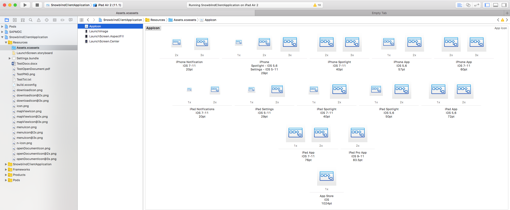

# app-iconator

Given a large image it will generate the required app icons and index files for a mobile application

### Install Instructions

```sh
cd app-icons
npm i
```

### Usage

```sh
$ ./app-icons.js -h

  Usage: app-icons [options]


  Options:

    -V, --version                output the version number
    -i, --icon <file-path>       Base icon (at least 1024x1024)
    -a, --appIconSet <dir-path>  Path to AppIcon.appiconset/ dir (...App_Resources/iOS/Assets.xcassets/AppIcon.appiconset)
    -h, --help                   output usage information
```

### Example

Provide an input image **at least** 1024x1024 for iOS applications! For example `SomeIcon.png`:


Run the command pointing to your `AppIcon.appiconset`:

```sh
./app-icons.js -i SomeIcon.png -a ../../src/SnowblindClientApplication/app/App_Resources/iOS/Assets.xcassets/AppIcon.appiconset/
```

Open the icon set in Xcode (drag the `Assets.xcassets` directory from Finder to the Xcode icon) and verify all icons are properly set:



Prepare/build your project with `tns` as usual and enjoy.
