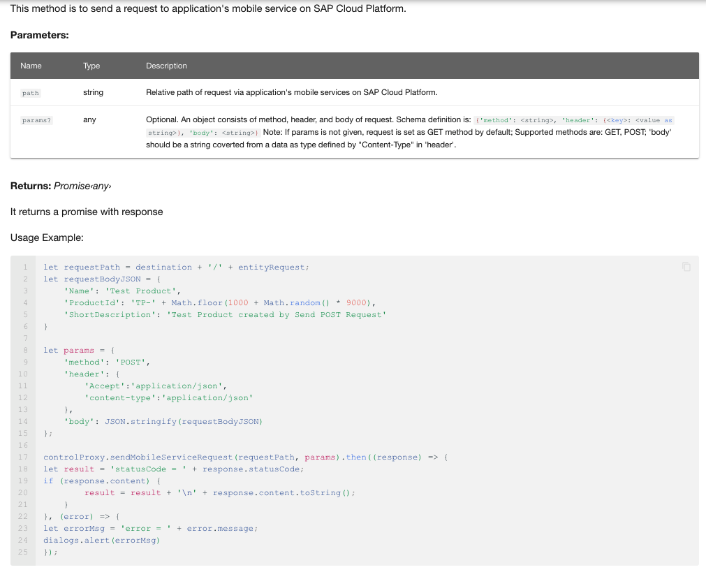

# API Reference Generator

Generating documentation of API references for ClientAPI and Context objects

## Setup

The API reference generator will make use of TypeDoc to generate API reference in html format, and make use of typedoc-plugin-markdown to generate API reference in markdown format.

* TypeDoc (<https://typedoc.org/api)>
* TypeDoc Plugin for Markdown (<https://www.npmjs.com/package/typedoc-plugin-markdown)>

To install TypeDoc and required components:

  npm install

## Generate API Reference (Markdown)

On Mac, please run

  ./gendoc2md.command

  or npm run gendoc2md

On Windows, please run

  gendoc2md.cmd

The API Reference (Markdown) will be generated into the api-reference-docs/dosc-en/docs/reference/apidoc folder under sdk root folder.

## The raw API document for the API Reference

Currently, the API Reference Generator will fetch the raw API comment and generate markdown documents, which defined in typedocconfig.ts. The file list will be defined in the "src" section as an array. Currently, the files included for API definition are:  

  'mdk-core/src/context/ClientAPI.ts',

  'mdk-core/src/context/IClientAPI.d.ts',

  'mdk-core/src/context/Context.ts',

  'mdk-core/src/context/IContext.ts',

  'mdk-core/src/ClientEnums.ts',

  'mdk-core/src/controls/IFilterable.ts',

  'mdk-core/src/controls/PressedItem.ts',

  'mdk-core/src/data/ITargetSpecifier.d.ts',

  'mdk-core/src/builders/odata/DataQueryBuilder.ts',

  'src/SnowblindClientApplication/plugins/SAP/Foundation/Common/Logger/LoggerManager.ts'

If you want to generate new markdown file from additional .ts files for API reference, you need to add the files to typedocconfig.ts.

To show the new generated API in the toc of the reference, you need to add the new markdown to mkdocs.yml under the section of "Client API References".

In any API .ts file, once you add a new function, you should add comments to it. The format for the comments should look like:

```javascript

/**
   * This method is to send a request to application's SAP Mobile Services.
   *
   * @param path Relative path of request via application's SAP Mobile Services.
   * @param params Optional. An object consists of method, header, and body of request.
   * Schema definition is:
   * ```
   * {'method': <string>, 'header': {<key>: <value as string>}, 'body': <string>}
   * ```
   * Note: If params is not given, request is set as GET method by default; Supported methods are:
   * GET, POST; 'body' should be a string coverted from a data as type defined by "Content-Type"
   * in 'header'.
   *
   * @returns It returns a promise with response
   *
   * Usage Example:
   * ```
   * let requestPath = destination + '/' + entityRequest;
   * let requestBodyJSON = {
   *   'Name': 'Test Product',
   *   'ProductId': 'TP-' + Math.floor(1000 + Math.random() * 9000),
   *   'ShortDescription': 'Test Product created by Send POST Request'
   * }
   *
   * let params = {
   *   'method': 'POST',
   *  'header': {
   *    'Accept':'application/json',
   *    'content-type':'application/json'
   *  },
   *  'body': JSON.stringify(requestBodyJSON)
   * };
   *
   * controlProxy.sendMobileServiceRequest(requestPath, params).then((response) => {
   * let result = 'statusCode = ' + response.statusCode;
   * if (response.content) {
   *    result = result + '\n' + response.content.toString();
   *    dialogs.alert(result)
   *  }
   * }, (error) => {
   * let errorMsg = 'error = ' + error.message;
   * dialogs.alert(errorMsg)
   * });
   * ```
   */
```

The result reference will be


